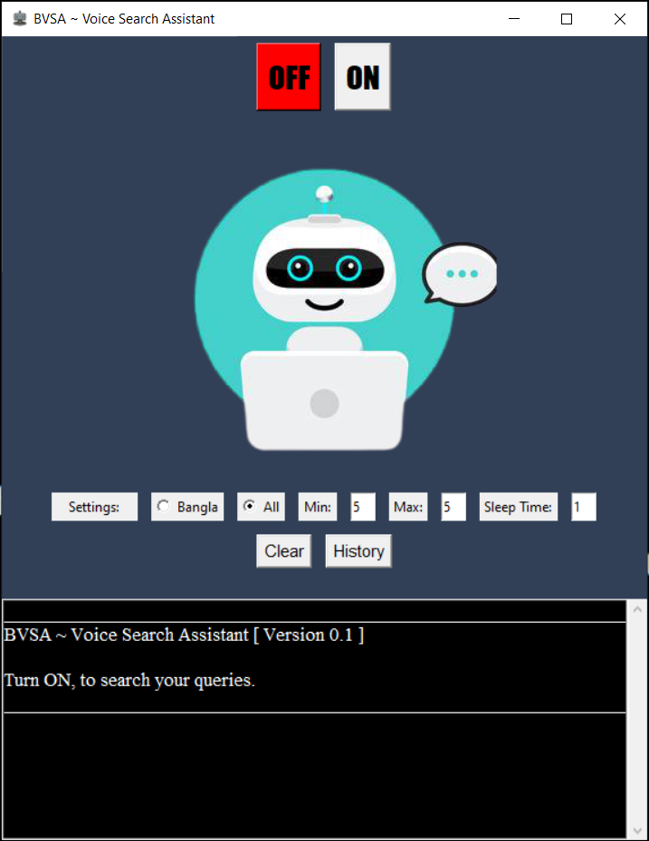
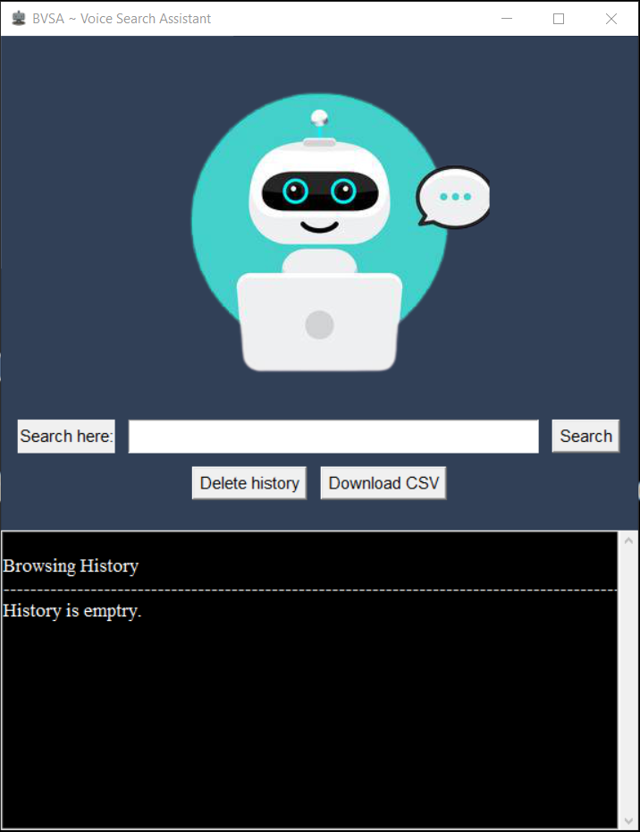

# BVSA ~ Voice Search Assistant

Desktop application that searches most relevant web pages using voice built with python.

### Demo

YouTube link : https://youtu.be/VUidT1mlkkI

[Font view 1]

[Font view 2]

### Usage

1. Requirements
    * Python 3
    * PIP (Python package manager)

2. Installation
    * `pip install -r requirements.txt`

3. Running
    * `python main.py`
